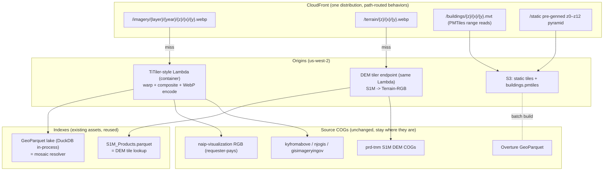

# CONUS Flight Simulator — Architecture & Phased Build Plan

Planning document for a new project: a browser "flight simulator" style streaming
viewer over NAIP (and other state COG imagery), USGS 3DEP S1M terrain, and
Overture buildings. Based on learnings and data from
[`deckgl-s3-cog-s1m`](https://github.com/mwkorver/deckgl-s3-cog-s1m).

Written 2026-07-08 as a planning document, before any code existed. It is kept
as the design record — the reasoning in §2, §6 and §10 is why the thing is
shaped the way it is, and that reasoning is still the interesting part.

**It is not a description of what runs.** For that, read [README.md](README.md)
(as-built architecture) and [infra/README.md](infra/README.md) (deployment).
§0 below reconciles the two: what shipped, what shipped differently, and what
was never built. Individual sections are annotated where they say something no
longer true.

Last reconciled against the code: **2026-08-06**.

---

## 0. Status — plan vs. as-built

### Held as planned

Every locked decision in [§2](#2-locked-decisions) survived contact. The flat Mercator world, the single 3857
quadtree, path-only immutable cache keys, WebP 512, Terrarium terrain,
three.js, and us-west-2 are all exactly as specified. Phase 0 shipped in full
and its measurements are recorded in [§9](#9-phased-plan). All five open
questions in [§10](#10-open-questions-settle-in-phase-0) were settled and none
were reopened.

### Shipped, but not as drawn

| Area | Plan | As built |
|---|---|---|
| DEM tiers | Two: S1M near-field, `elevation-tiles-prod` far-field | **Three**: S1M → USGS 1/3" (10 m) → far-field. The 1/3" tier also void-fills S1M's ragged coverage edges, which [§4.2](#42-terrain) had hand-waved as "void fill or transparent" |
| Low-zoom imagery | Pre-genned z0–z12 static pyramid on S3 | **`/basemap/{z}/{x}/{y}.webp`** — a live endpoint stitching four USDA NAIP ImageServer cache tiles into one 512. The COG mosaic fan-out was too slow and coverage-capped down there, and this needed no pre-gen job at all. The pyramid was never built |
| 3D Buildings | Static PMTiles range reads from S3 ([§4.3](#43-buildings--shipped-buildingszxypbf)) | **`/buildings/{z}/{x}/{y}.pbf`** — dynamic serverless MVT vector tiles generated via DuckDB `ST_AsMVT()` over Overture Maps / MS Building Footprints GeoParquet lake partitions on S3. Fetched once at a single source zoom and re-extruded per terrain tile, so footprints are seated on whatever terrain is under them as the camera descends |
| Coverage fallback | "Client renders no-data as fallback-LOD terrain" ([§8](#8-cost--risk-notes)) | **`/footprints/{s1m,usgs13}.json`** — two static vectors (~360 KB gzipped) the client fetches once and clips against, so it knows where coverage ends before requesting. Not in the plan at all |
| Client hosting | Implicit; CloudFront served tiles only | The **same distribution serves the compiled app**, so there is one origin story for the whole demo |
| Access control | Not considered | A viewer-request CloudFront Function gates everything on `?k=<key>`, to keep crawlers off requester-pays reads. Not a real secret — it ships in the bundle |
| Imagery sources | Multiple COG layers (`nj-imagery`, `kyfromabove`, …) | One COG layer plus an **OSM roads** basemap toggle — a different axis than planned (see below) |
| Infra shape | SAM/CFN, `foundation → tiler → static assets` ([§7](#7-reuse-from-deckgl-s3-cog-s1m)) | **AWS CDK (TypeScript)**, `tiler → edge`. No foundation stack: CDK bootstrap covers ECR/staging, and the edge stack owns the per-account static bucket, seeded from one shared public requester-pays bucket |

### Never built

- **Any second imagery layer.** The registry holds exactly one entry,
  `naip-visualization`. `nj-imagery`, `kyfromabove` and `in-imagery` were never
  onboarded, so the `{layer}` path segment is real but single-valued and the
  per-layer ceilings table in [§5.2](#52-per-layer-zoom-ceilings-256-px-basis--seclat-for-ground-mpx)
  is still aspirational. Per-layer maxzoom logic is implemented and exercised —
  just never against a second layer.
- **All of Phase 2 and Phase 3**, except coverage-aware fallback (shipped as
  footprints, above) and time-of-day *lighting* (sun azimuth/altitude and
  preset moods are client-side controls; the planned NAIP-vintage "season"
  toggle is not built).

---

## 1. Core idea

The existing viewer proves client-side COG streaming works, but its access
pattern is wrong for sustained flight: per-COG range reads, per-COG cache keys,
browser-side reprojection (UTM/Albers → screen), and per-user presigned URLs
that defeat CDN caching.

This project moves normalization server-side and makes **one quadtree the
universal contract**:

- Server-level tiler (TiTiler-style) reads the *same COGs already on S3*,
  warps once to Web Mercator, and serves **WebP imagery tiles**, **terrain
  tiles**, and **building vector tiles** on the same `z/x/y` grid.
- CloudFront in front of everything; tiles are immutable and cache forever.
- The browser still renders terrain (meshes, LOD, camera) but **never
  reprojects** — tile XY is world XY.
- Uniform keys make client caching and flight-path prefetch trivial.

## 2. Locked decisions

| # | Decision | Choice | Rationale |
|---|----------|--------|-----------|
| 1 | Coverage | **CONUS only** | Bounds precision & projection choices; matches NAIP/S1M coverage |
| 2 | Tile grid | **EPSG:3857 (Web Mercator) XYZ** | Every tool speaks it (TiTiler, tippecanoe, PMTiles, deck.gl); path-based CDN keys; distortion handled as scale factor, not reprojection |
| 3 | World model | **Flat Mercator-meter world, Z-up** | No ellipsoid, no ENU rotations, trivial physics. Ground-truth via `sec(lat)` scale (see [§5.1](#51-coordinates--precision-bake-in-from-day-one)) |
| 4 | Imagery tiles | **WebP, 512 px, dynamic TiTiler** + ~~pre-genned low/mid zooms (z0–z12)~~ — *pyramid never built; low zoom is the live `/basemap/*` stitch instead ([§0](#0-status--plan-vs-as-built))* | Full pre-gen of CONUS to z17+ is tens of TB for sparse access; dynamic-behind-CDN fills organically; small pre-genned pyramid guarantees instant cold start |
| 5 | Mosaic resolver | **GeoParquet lake as the mosaic index** | Biggest reuse from the existing repo: "which COGs intersect tile z/x/y" *is* `/search`. Year-pinned mosaics = path parameter. Sourced from STAC GeoParquet index bucket `s3://naip-geoparquet-index/manifest-index` |
| 5a | NAIP source | **`naip-visualization` RGB COGs** (not `naip-analytic` RGBIR) | 3-band uint8 JPEG COGs, display-ready — the tiler dropped the IR band anyway; smaller reads. Lake collection = `naip-visualization`, served at `/imagery/naip-visualization/...` |
| 6 | Terrain payload | **Terrain-RGB (Terrarium-style) raster tiles from S1M**, quantized-mesh deferred | One pipeline with imagery (same tiler, same quadtree); client meshes regular grids (simpler than the current drape mesher). Revisit quantized-mesh only if client meshing shows up in profiles |
| 7 | Far-field terrain | **AWS Open Data `s3://elevation-tiles-prod` (Mapzen Terrarium)** | Already tiled in exactly this scheme, global, free; S1M kicks in below a screen-space-error threshold |
| 8 | Buildings | ~~**Overture → tippecanoe → PMTiles on S3 + CloudFront**~~ — **this route was never built**; buildings ship as a dynamic MVT endpoint instead ([§4.3](#43-buildings--shipped-buildingszxypbf)) | Fully static, zero servers, range-read friendly, zoom-graded simplification for free — but it needed a pre-gen pipeline, and the lake could already answer the query directly |
| 9 | Rendering engine | **three.js — not CesiumJS** (settled [§10.2](#10-open-questions-settle-in-phase-0), 2026-07-09) | See [§6](#6-engine-decision-custom-renderer-vs-cesiumjs). Cesium = globe engine overhead for pre-aligned tiles; custom pipeline keeps the GPU raster/mesh control and velocity prefetch. three won the Phase 0 spike (least friction, native free-fly camera); luma.gl kept as WebGPU fallback. Backend stays engine-agnostic so Cesium/luma remain fallback consumers |
| 10 | Region | **us-west-2** | Same as sources (`naip-visualization`, `prd-tnm` etc., per RODA); requester-pays reads become same-region GET pennies. All reads signed via the execution role; requester-pays scoped per-bucket |

## 3. Architecture

> **This diagram is the plan, not the deployment.** The static `z0–z12` pyramid
> was never built. `/buildings/*` exists but not as drawn — it is a live MVT
> endpoint over the Overture lake, not PMTiles range reads against a pre-genned
> file ([§4.3](#43-buildings--shipped-buildingszxypbf)). Four things it doesn't
> show did get built: `/basemap/*` (live low-zoom stitch), `/footprints/*`
> (coverage vectors), the compiled web app served from the same distribution,
> and a USGS 1/3" DEM tier between S1M and the far field. See
> [§0](#0-status--plan-vs-as-built); the as-built diagram is in
> [README.md](README.md).

Client (browser): custom renderer, one LOD manager over `z/x/y` "tile bundles"
(imagery texture + terrain mesh + buildings), byte-budgeted LRU cache,
frustum + velocity-vector prefetch. No reprojection, no COG parsing, no
signing.

## 4. Tile service spec (v0)

### 4.1 Imagery

- `GET /imagery/{layer}/{year}/{z}/{x}/{y}.webp`
  - `layer` = collection id from the registry (`naip-visualization`, `kyfromabove`,
    `nj-imagery`, `in-imagery`, …); `year` pinned in the path (never query
    strings — CloudFront cache keys stay path-only, and mosaics stay
    single-vintage to avoid color seams).
  - 512×512 WebP, quality ~75 (≈30–80 KB/tile target).
  - Resolver: lake query `collection + year + tile bbox` → COG list → rio-tiler
    mosaic read → warp to 3857 → encode. All reads signed via the role;
    requester-pays scoped per-asset to the buckets that need it ([§2 row 5a](#2-locked-decisions)).
  - Per-layer `maxzoom` from registry `gsd` (see table [§5.2](#52-per-layer-zoom-ceilings-256-px-basis--seclat-for-ground-mpx)); requests beyond
    it 404 (client clamps; CDN never caches upsampled junk).
- ~~Pre-generated static pyramid z0–z12 written to S3 once per layer/year~~
  **Not built.** Low zoom is served live by `/basemap/{z}/{x}/{y}.webp`
  instead — see [§0](#0-status--plan-vs-as-built).

### 4.2 Terrain

- `GET /terrain/{z}/{x}/{y}.webp` (or `.png`)
  - Terrain-RGB encoding, **Terrarium** packing ([§10.5](#10-open-questions-settle-in-phase-0)), **lossless** WebP.
  - Grid (**decided**): vanilla **512×512**, standard registration — no
    overlap ring, no 257-vertex grids. Matches the imagery tile size (one
    quadtree, one size); a 512 tile at z carries 256-tile resolution at z+1,
    so maxzoom drops and request count quarters. Seam hiding is the client's
    job: skirts generated at mesh-build time (see [§5.3](#53-lod--streaming)) handle both same-zoom
    hairline cracks and cross-LOD T-junctions with one mechanism. Rationale:
    skirts are a rendering artifact, not data — baking a bespoke registration
    convention into the tiles would break third-party consumers (MapLibre,
    Cesium fallback) and split the near/far-field contract.
  - Known residuals (accepted): edge normals are one-sided without an overlap
    ring — resolved later by server-side normal tiles (Phase 2), which are a
    data product and belong serverside; skirt texture stretch tuned via
    per-zoom skirt height (Cesium's published formula as starting point);
    building seating reads elevation directly rather than raycasting the scene,
    so skirt geometry can't pollute picking. As built it samples the terrain
    mesh's own vertices, not the height raster the plan assumed — the raster is
    unscaled, and mesh Z already carries `mercatorScale(lat)`
    ([§4.3](#43-buildings--shipped-buildingszxypbf)).
  - Source: S1M COGs via `S1M_Products.parquet` lookup; `-999999` nodata → void
    fill or transparent.
  - `maxzoom` ≈ 15–16 (1 m source at 512 px); below-threshold zooms can
    proxy/copy `elevation-tiles-prod` so the client speaks **one terrain
    endpoint** for near and far field. Note: `elevation-tiles-prod` is 256-px
    Terrarium, so far-field passthrough isn't byte-for-byte — the tiler
    composites four upstream 256s into one 512 (or the client treats
    far-field as a z+1 fetch).
  - Optional later: pack server-computed normals into a parallel tile layer (or
    alpha) for free sun-angle shading.

### 4.3 Buildings — Shipped (`/buildings/{z}/{x}/{y}.pbf`)

- Serverless Lambda endpoint `GET /buildings/{z}/{x}/{y}.pbf` (`application/x-protobuf`).
  - DuckDB `ST_AsMVT()` queries Overture Maps / MS Building Footprints GeoParquet lake partitions on S3. `ST_AsMVTGeom(..., clip_geom=true)`, so a building crossing a tile boundary arrives already cut.
  - LOD floor $z \ge 14$: served at high zoom, 404 below.
  - The client fetches at **one** configurable source zoom (`?buildingzoom=`, default 14), not per tile. Footprints do not change with zoom — only the terrain under them and the imagery on them do — so asking per tile ran the same query 256 times over between z14 and z18.
  - The Web Worker only decodes MVT to per-building vectors (`decodeBuildings` in `buildingMesh.ts`). Those vectors are cached by source tile (`buildingCache.ts`) and extruded on the main thread, per terrain tile, against that tile's own mesh and UVs (`buildTileBuildings`) — which is what lets one fetch serve every zoom above it. Base elevation samples the terrain **mesh**, not the raw heightfield: mesh Z already carries `mercatorScale(lat)`, and sampling the unscaled raster sinks or floats buildings by that factor.
  - Two draw groups per tile: flat-shaded walls, and roofs sharing the tile's terrain material so they carry the aerial imagery.

## 5. Client architecture notes

### 5.1 Coordinates & precision (bake in from day one)

- **World = Mercator meters (float64 on CPU), Z-up.**
- **`sec(lat)` scale factor**: a Mercator meter ≠ ground meter (~1.10× Miami,
  ~1.31× Denver, ~1.52× at 49°N). One function `mercatorScale(lat)`, evaluated
  per tile anchor, routes **every** true-meters→world conversion:
  terrain Z, building heights, airspeed/physics. Miss one and slopes flatten
  going north / the plane "slows down" going south.
- **GPU renders anchor-relative float32** (camera- or tile-anchor offsets —
  the `METER_OFFSETS` pattern from the existing repo). Raw Mercator X for CONUS
  is ~1e7; float32 there is ~1 m precision — useless against 8 cm imagery.

### 5.2 Per-layer zoom ceilings (256-px basis; ÷ sec(lat) for ground m/px)

| Source | Ground res | Fully resolved ~z |
|---|---|---|
| S1M DEM | 1 m | 16–17 |
| NAIP | 60 cm / 1 m | 17–18 |
| KyFromAbove / NJ | ~15 cm | 19–20 |
| Indiana 3-inch | 8 cm | 20–21 |

`maxzoom` is registry metadata (`gsd` already exists in descriptors), not a
global constant.

### 5.3 LOD & streaming

- Tile-bundle cache keyed `z/x/y` (+ layer), byte-budgeted LRU (the 96 MB
  budgeted-cache pattern, scaled up).
- Terrain LOD by screen-space error (Cesium's formula is public; steal the
  math, not the engine).
- Skirts generated client-side at mesh-build time: one extra vertex ring
  copied from the edge and dropped by a per-zoom height (Cesium's formula),
  O(perimeter) on an O(area) pass. Hides same-zoom cracks and cross-LOD
  T-junctions with one mechanism; keeps server tiles vanilla ([§4.2](#42-terrain)).
- **Velocity-vector prefetch**: fetch bundles the camera will see in 3–5 s
  from position + heading + speed. This is the sim's killer optimization and
  the main reason for a custom LOD manager.
- HTTP/2/3 multiplexing via CloudFront; no signing round-trips.

## 6. Engine decision (custom renderer vs CesiumJS)

Chosen: **three.js** (settled [§10.2](#10-open-questions-settle-in-phase-0) after the Phase 0 spike; luma.gl kept as
the WebGPU fallback path). Reasons recorded for going custom over Cesium:

- Cesium runs planet-scale machinery per frame (ellipsoid traversal,
  atmosphere, ECEF double-precision camera) that a pre-aligned flat world
  doesn't need.
- Its imagery/terrain customization points can't exploit "texture and mesh on
  the same quadtree" (one texture, one mesh, zero runtime projection).
- No first-class hook for velocity prefetch in its tile traversal.
- Terrain-RGB ingestion would need a custom `TerrainProvider` re-meshing into
  Cesium's internal format — an extra CPU stage.
- WebGPU headroom: luma.gl v9 / three are further along.

What we give up (accepted): Cesium's solved problems — skirts, popping
mitigation, horizon culling, atmosphere, camera controllers. Mitigation: the
server normalizes the data mess first, so the custom pipeline handles exactly
one layout; borrow Cesium's published math (SSE, skirts) and keep tile formats
engine-agnostic so CesiumJS remains a fallback consumer if custom terrain LOD
stalls.

## 7. Reuse from `deckgl-s3-cog-s1m`

| Asset | Role here |
|---|---|
| GeoParquet lake + in-process DuckDB pattern | Mosaic index backing the imagery tiler |
| `registry.yaml` + descriptors | Layer onboarding; add `maxzoom` derived from `gsd` |
| `S1M_Products.parquet` + build script | DEM lookup for terrain tiler |
| Requester-pays / signing knowledge | Tiler S3 config (simpler: one role, zero browser signing) |
| Drape mesher (`SimpleMeshLayer` path) | Basis for terrain-tile mesher, simplified to regular grids |
| Byte-budget cache, concurrency=16, bottom-first sort learnings | Client bundle cache & fetch scheduler |
| Foundation/seed stack pattern | Adapted: `tiler → edge` in CDK, no separate foundation stack. The edge stack owns the per-account static bucket and seeds it from one shared public requester-pays bucket |
| Ingest pipeline | Unchanged — it feeds the lake the tiler resolves against |

## 8. Cost & risk notes

- **CloudFront egress (~$0.085/GB)** is the dominant scale cost → WebP q≈75,
  512-px tiles, aggressive client cache.
- **Cold tile latency** (COG read + warp + encode ≈ 100–500 ms): acceptable
  behind prefetch; mitigations in order — pre-genned z0–12, origin shield,
  async write-behind of hot tiles to S3 (Phase 2, only if p99 demands it).
- **Lambda spike** on fast low passes → reserved concurrency + the static
  pyramid blunt it.
- **NAIP vintage seams** → single-year mosaics per path ([§4.1](#41-imagery)).
- **S1M coverage gaps** (still expanding) → far-field terrain fallback fills;
  client renders no-data as fallback-LOD terrain rather than holes.
- **Requester-pays on misses**: same-region GETs only; monitor
  request counts, not egress.

## 9. Phased plan

### Phase 0 — prove the loop (1 corridor, ~2–3 weeks of focused work)
Goal: fly a camera over one corridor — **New Jersey, NAIP** ([§10.3](#10-open-questions-settle-in-phase-0)): the
most representative source (requester-pays, CONUS-wide access pattern),
with `nj-imagery` upgrade waiting in Phase 1 — with server tiles end-to-end.

1. New repo skeleton: `tiler/` (Python, thin rio-tiler service on Lambda
   container — [§10.4](#10-open-questions-settle-in-phase-0)),
   `client/` (TS, three.js renderer — [§10.2](#10-open-questions-settle-in-phase-0)), `infra/` (SAM/CFN, reuse
   foundation pattern), `PLAN.md` (this file).
2. Imagery tiler: lake-backed mosaic resolver → `/imagery/naip-visualization/{year}/z/x/y.webp`
   (NJ, latest vintage in the lake),
   Lambda Function URL origin behind CloudFront, path-immutable caching.
3. Terrain tiler: S1M → Terrain-RGB for the corridor bbox; far-field passthrough
   of `elevation-tiles-prod`.
4. Client: flat Mercator world, anchor-relative rendering, terrain mesh from
   Terrain-RGB, imagery as texture (same tile = same key), free-fly camera.
5. ~~Measure~~ **Done 2026-07-11** — results below.

**Measured (Phase 0 step 5):**
- Tile latency over CloudFront: **CDN-warm p50 0.17s / p95 0.24s / p99 0.55s**;
  **cold (origin miss) p50 9.8s / p99 11.0s** — the 57× gap is the ~7s
  import-dominated cold start. Warm throughput ≥46 tiles/s (client-limited).
- Frame time (three.js, engine benchmark): **60 fps**, CPU 0.3–1.1 ms/frame,
  interval p95 ~17 ms; live app holds this at ~197 active LOD tiles.
- Lambda cost/flight-hour (2 GB arm64, measured durations): **~$0.01 warm CDN,
  ~$0.06 cold-exploration** — pennies at single-user scale.
- Cold path hardened: DuckDB extensions baked into the image ([§8](#8-cost--risk-notes)), account
  concurrency raised 10→1000, tiler reserved at 100, client 429 backoff.

**Exit criteria:** sustained 60 fps low pass with no visible tile starvation on
a warm CDN. **Met ✅** on a warm CDN. Residual: on *cold* first-exploration the
~10s tile latency causes visible pop-in until the CDN warms — the pre-genned
z0–z12 pyramid (Phase 2) is the prescribed mitigation.

### Phase 1 — make it a sim
- ~~Velocity-vector prefetch + byte-budgeted bundle cache.~~ **Done** ([§5.3](#53-lod--streaming)).
- ~~`sec(lat)` scale audit (single conversion function + tests).~~ **Done** —
  found and fixed two true-metre vs Mercator-metre Z bugs in frustum culling
  and LOD distance.
- Second layer (`nj-imagery`, ~15 cm, same corridor) + layer switching;
  per-layer maxzoom clamps exercised for real (NAIP z17–18 vs NJ z19–20).
  **Not done.** An earlier revision of this line claimed the tiler layer was
  registered and only the client toggle was missing; that was wrong. The
  registry has one entry, `naip-visualization`. What did ship is a different
  axis of switching — NAIP aerial vs. an OSM roads basemap — which exercises
  the source-routing plumbing but not per-layer maxzoom against a finer source.
- Basic flight model (even arcade physics) to drive the prefetcher honestly.
  **Partial** — free-fly with a speed setting, inertia/glide damping and a
  minimum ground clearance, which is enough to drive the prefetcher off a real
  velocity vector. No aerodynamics: no lift, stall, bank-to-turn or gravity.
- ~~**Follow-DEM camera mode** (ported from pTolemy3D's `setFollowDem`):
  maintain constant above-ground clearance instead of above-sea-level
  altitude.~~ **Done** — "FOLLOW TERRAIN (AGL hold)" in the HUD, fed by
  `TileManager.getElevationAt()`. The AGL target is also an *output*: wheel
  zoom and Q/E write back to it, so the two controls can't disagree.
- ~~**FlyTo animated trajectories** (ported from pTolemy3D's `flyTo` /
  `flyToPositionSpeed`)~~ **Done** — double-click flies an arc that climbs to
  a cruise altitude and descends onto the target, replacing the instant
  `lerp(point, 0.5)` jump.
- ~~Buildings: Overture → PMTiles, terrain-seated extrusions.~~ **Done, by a
  different route** — terrain-seated extrusions ship, but from a live MVT
  endpoint over the Overture lake rather than a pre-genned PMTiles file
  ([§4.3](#43-buildings--shipped-buildingszxypbf)). The PMTiles pipeline is the
  piece of the plan that never happened.

### Phase 2 — scale & polish

Not started, except where noted.

- Pre-gen z0–z12 pyramids per layer/year; static-first origin routing.
  **Superseded** by the live `/basemap/*` stitch ([§0](#0-status--plan-vs-as-built)).
- Hot-tile write-behind (only if Phase 0/1 metrics demand).
- Server-side normal tiles → sun-angle shading.
- CONUS-wide terrain (full S1M maxzoom map), coverage-aware fallbacks.
  **Coverage-aware fallback done** via the static footprint vectors; the
  full maxzoom map is not.
- Cost dashboard: CloudFront/Lambda/S3 per flight-hour.

### Phase 3 — evaluate upgrades (data-driven, not speculative)

Not started. Nothing here was ever triggered by a measurement, which is the
point — these were gated on evidence that did not appear.

- Quantized-mesh vs Terrain-RGB (only if client meshing is a measured
  bottleneck).
- WebGPU renderer path.
- Time-of-day / seasonal layers (NAIP vintage as "season" toggle).
  Time-of-day *lighting* shipped (sun azimuth/altitude, preset moods); the
  vintage toggle did not.
- Multiplayer/state sync, if it's ever more than a viewer.

## 10. Open questions (settle in Phase 0)

1. ~~Terrain tile grid~~ **Settled 2026-07-08**: vanilla 512×512, standard
   registration; client builds skirts at mesh time (see [§4.2](#42-terrain)).
2. ~~deck.gl vs luma.gl vs three.js~~ **Settled 2026-07-09**: **three.js**.
   All three were spiked against the same baked NJ tiles and a shared
   benchmark: load the block, build a skirted gridded mesh, drape the matching
   imagery tile, free-fly over it and time frames. Light load — 16 tiles, mesh
   step 4, ~13 s timed run — all three rendering correctly:

   | engine | fps | frame p95 / max | cpu/frame p50 | friction to get there |
   |---|---|---|---|---|
   | three.js | 60 | 17.4 / 19.3 ms | 0.3 ms | none — direct BufferGeometry, UV texture, free eye/target camera |
   | luma.gl | 60 | 17.6 / 28.3 ms | 0.6 ms | most fixes: Vite dedupe of `@luma.gl/core`, batched UBO, a canvas auto-resized to 16384² (black + fill-bound) |
   | deck.gl | 60 | 18.3 / 21.7 ms | n/a | `SimpleMeshLayer` mesh format; `OrbitView` has **no free eye/target** camera |

   deck's `metrics.cpuTime` isn't per-frame ms, so it isn't comparable to the
   timed render calls in three/luma. All three clear the tile contract at 60 fps
   with low CPU, so the clean differentiators were friction and camera fit, both
   favouring three.js: it rendered first try in 81 LOC and ships the frustum
   culling / raycasting / materials needed next. luma.gl is perf-equal once its
   footguns are fixed and remains the WebGPU fallback (Phase 3); deck.gl's
   `OrbitView` actively fights free flight.

   Heavy load (144–256 tiles) was not a clean ranking: every engine falls to
   ~1 fps once VRAM is exhausted, because the harness gave each replicated tile
   its own texture. That measures naive resource management, not draw paths —
   the real lesson is that at scale the bottleneck is GPU resource sharing
   (atlasing / instancing), which the LOD manager owns, not the engine.

   The spike code has since been removed; `client/src/core/` carries the
   renderer it became.
3. ~~Phase 0 corridor~~ **Settled 2026-07-08**: New Jersey on **NAIP** —
   the most representative source (requester-pays, CONUS-wide pattern) —
   with `nj-imagery` (~15 cm) as the Phase 1 second layer over the same
   corridor, exercising layer switching and per-layer maxzoom on ground
   already flown.
4. ~~TiTiler proper vs thin rio-tiler~~ **Settled 2026-07-08**: thin rio-tiler
   service on the existing FastAPI/Lambda scaffolding. The mosaic resolver
   (DuckDB over the lake) is custom either way — TiTiler has no lake backend;
   TiTiler's parameterized-tiling flexibility is this project's anti-goal
   (path-only, immutable cache keys); smaller container = faster cold start.
   May depend on `titiler-core` internals (rendering utils, nodata/alpha
   handling) without adopting the application layer.
5. ~~Terrain-RGB encoding~~ **Settled 2026-07-08**: Terrarium. Matches
   `elevation-tiles-prod`, so the far-field passthrough (256→512 compositing)
   is pure pixel copying — no decode/re-encode, no conversion bugs at the
   near/far-field boundary — and the client runs one decoder everywhere.
   Precision (1/256 m) exceeds the 1 m source; MapLibre `raster-dem` supports
   it natively so third-party fallback is unaffected.
