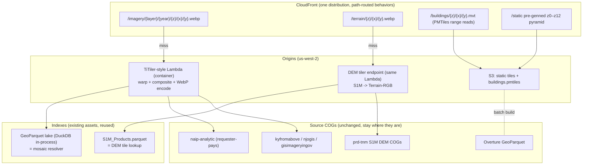

# CONUS Flight Simulator — Architecture & Phased Build Plan

Planning document for a new project: a browser "flight simulator" style streaming
viewer over NAIP (and other state COG imagery), USGS 3DEP S1M terrain, and
Overture buildings. Based on learnings and data from
[`deckgl-s3-cog-s1m`](https://github.com/mwkorver/deckgl-s3-cog-s1m).

Status: **planning only** — no code yet. 2026-07-08.

---

## 1. Core idea

The existing viewer proves client-side COG streaming works, but its access
pattern is wrong for sustained flight: per-COG range reads, per-COG cache keys,
browser-side reprojection (UTM/Albers → screen), and per-user presigned URLs
that defeat CDN caching.

This project moves normalization server-side and makes **one quadtree the
universal contract**:

- Server-level tiler (TiTiler-style) reads the *same COGs already on S3*,
  warps once to Web Mercator, and serves **WebP imagery tiles**, **terrain
  tiles**, and **building vector tiles** on the same `z/x/y` grid.
- CloudFront in front of everything; tiles are immutable and cache forever.
- The browser still renders terrain (meshes, LOD, camera) but **never
  reprojects** — tile XY is world XY.
- Uniform keys make client caching and flight-path prefetch trivial.

## 2. Locked decisions

| # | Decision | Choice | Rationale |
|---|----------|--------|-----------|
| 1 | Coverage | **CONUS only** | Bounds precision & projection choices; matches NAIP/S1M coverage |
| 2 | Tile grid | **EPSG:3857 (Web Mercator) XYZ** | Every tool speaks it (TiTiler, tippecanoe, PMTiles, deck.gl); path-based CDN keys; distortion handled as scale factor, not reprojection |
| 3 | World model | **Flat Mercator-meter world, Z-up** | No ellipsoid, no ENU rotations, trivial physics. Ground-truth via `sec(lat)` scale (see §5.1) |
| 4 | Imagery tiles | **WebP, 512 px, dynamic TiTiler + pre-genned low/mid zooms (z0–z12)** | Full pre-gen of CONUS to z17+ is tens of TB for sparse access; dynamic-behind-CDN fills organically; small pre-genned pyramid guarantees instant cold start |
| 5 | Mosaic resolver | **GeoParquet lake as the mosaic index** | Biggest reuse from the existing repo: "which COGs intersect tile z/x/y" *is* `/search`. Year-pinned mosaics = path parameter |
| 6 | Terrain payload | **Terrain-RGB (Terrarium-style) raster tiles from S1M**, quantized-mesh deferred | One pipeline with imagery (same tiler, same quadtree); client meshes regular grids (simpler than the current drape mesher). Revisit quantized-mesh only if client meshing shows up in profiles |
| 7 | Far-field terrain | **AWS Open Data `s3://elevation-tiles-prod` (Mapzen Terrarium)** | Already tiled in exactly this scheme, global, free; S1M kicks in below a screen-space-error threshold |
| 8 | Buildings | **Overture → tippecanoe → PMTiles on S3 + CloudFront** | Fully static, zero servers, range-read friendly, zoom-graded simplification for free |
| 9 | Rendering engine | **three.js — not CesiumJS** (settled §10.2, 2026-07-09) | See §6. Cesium = globe engine overhead for pre-aligned tiles; custom pipeline keeps the GPU raster/mesh control and velocity prefetch. three won the Phase 0 spike (least friction, native free-fly camera); luma.gl kept as WebGPU fallback. Backend stays engine-agnostic so Cesium/luma remain fallback consumers |
| 10 | Region | **us-west-2** | Same as sources (`naip-analytic` etc.); requester-pays reads become same-region GET pennies |

## 3. Architecture

Client (browser): custom renderer, one LOD manager over `z/x/y` "tile bundles"
(imagery texture + terrain mesh + buildings), byte-budgeted LRU cache,
frustum + velocity-vector prefetch. No reprojection, no COG parsing, no
signing.

## 4. Tile service spec (v0)

### 4.1 Imagery

- `GET /imagery/{layer}/{year}/{z}/{x}/{y}.webp`
  - `layer` = collection id from the registry (`naip`, `kyfromabove`,
    `nj-imagery`, `in-imagery`, …); `year` pinned in the path (never query
    strings — CloudFront cache keys stay path-only, and mosaics stay
    single-vintage to avoid color seams).
  - 512×512 WebP, quality ~75 (≈30–80 KB/tile target).
  - Resolver: lake query `collection + year + tile bbox` → COG list → rio-tiler
    mosaic read → warp to 3857 → encode. Requester-pays header on NAIP reads.
  - Per-layer `maxzoom` from registry `gsd` (see table §5.2); requests beyond
    it 404 (client clamps; CDN never caches upsampled junk).
- Pre-generated static pyramid z0–z12 written to S3 once per layer/year
  (small; this is what every session hits constantly).

### 4.2 Terrain

- `GET /terrain/{z}/{x}/{y}.webp` (or `.png`)
  - Terrain-RGB encoding, **Terrarium** packing (§10.5), **lossless** WebP.
  - Grid (**decided**): vanilla **512×512**, standard registration — no
    overlap ring, no 257-vertex grids. Matches the imagery tile size (one
    quadtree, one size); a 512 tile at z carries 256-tile resolution at z+1,
    so maxzoom drops and request count quarters. Seam hiding is the client's
    job: skirts generated at mesh-build time (see §5.3) handle both same-zoom
    hairline cracks and cross-LOD T-junctions with one mechanism. Rationale:
    skirts are a rendering artifact, not data — baking a bespoke registration
    convention into the tiles would break third-party consumers (MapLibre,
    Cesium fallback) and split the near/far-field contract.
  - Known residuals (accepted): edge normals are one-sided without an overlap
    ring — resolved later by server-side normal tiles (Phase 2), which are a
    data product and belong serverside; skirt texture stretch tuned via
    per-zoom skirt height (Cesium's published formula as starting point);
    building seating samples the height raster, never mesh raycasts, so skirt
    geometry can't pollute picking (§4.3 already does this).
  - Source: S1M COGs via `S1M_Products.parquet` lookup; `-999999` nodata → void
    fill or transparent.
  - `maxzoom` ≈ 15–16 (1 m source at 512 px); below-threshold zooms can
    proxy/copy `elevation-tiles-prod` so the client speaks **one terrain
    endpoint** for near and far field. Note: `elevation-tiles-prod` is 256-px
    Terrarium, so far-field passthrough isn't byte-for-byte — the tiler
    composites four upstream 256s into one 512 (or the client treats
    far-field as a z+1 fetch).
  - Optional later: pack server-computed normals into a parallel tile layer (or
    alpha) for free sun-angle shading.

### 4.3 Buildings

- One-time (per Overture release) batch: Overture buildings GeoParquet →
  GeoJSONSeq → tippecanoe → `buildings.pmtiles` on S3.
  - Keep `height`, `num_floors`, class; zoom-graded drop/coalesce.
  - Client seats footprints by sampling the terrain tile grid (bilinear — the
    regular grid makes the current repo's mesh-raycast seating obsolete).

## 5. Client architecture notes

### 5.1 Coordinates & precision (bake in from day one)

- **World = Mercator meters (float64 on CPU), Z-up.**
- **`sec(lat)` scale factor**: a Mercator meter ≠ ground meter (~1.10× Miami,
  ~1.31× Denver, ~1.52× at 49°N). One function `mercatorScale(lat)`, evaluated
  per tile anchor, routes **every** true-meters→world conversion:
  terrain Z, building heights, airspeed/physics. Miss one and slopes flatten
  going north / the plane "slows down" going south.
- **GPU renders anchor-relative float32** (camera- or tile-anchor offsets —
  the `METER_OFFSETS` pattern from the existing repo). Raw Mercator X for CONUS
  is ~1e7; float32 there is ~1 m precision — useless against 8 cm imagery.

### 5.2 Per-layer zoom ceilings (256-px basis; ÷ sec(lat) for ground m/px)

| Source | Ground res | Fully resolved ~z |
|---|---|---|
| S1M DEM | 1 m | 16–17 |
| NAIP | 60 cm / 1 m | 17–18 |
| KyFromAbove / NJ | ~15 cm | 19–20 |
| Indiana 3-inch | 8 cm | 20–21 |

`maxzoom` is registry metadata (`gsd` already exists in descriptors), not a
global constant.

### 5.3 LOD & streaming

- Tile-bundle cache keyed `z/x/y` (+ layer), byte-budgeted LRU (the 96 MB
  budgeted-cache pattern, scaled up).
- Terrain LOD by screen-space error (Cesium's formula is public; steal the
  math, not the engine).
- Skirts generated client-side at mesh-build time: one extra vertex ring
  copied from the edge and dropped by a per-zoom height (Cesium's formula),
  O(perimeter) on an O(area) pass. Hides same-zoom cracks and cross-LOD
  T-junctions with one mechanism; keeps server tiles vanilla (§4.2).
- **Velocity-vector prefetch**: fetch bundles the camera will see in 3–5 s
  from position + heading + speed. This is the sim's killer optimization and
  the main reason for a custom LOD manager.
- HTTP/2/3 multiplexing via CloudFront; no signing round-trips.

## 6. Engine decision (custom renderer vs CesiumJS)

Chosen: **three.js** (settled §10.2 after the Phase 0 spike; luma.gl kept as
the WebGPU fallback path). Reasons recorded for going custom over Cesium:

- Cesium runs planet-scale machinery per frame (ellipsoid traversal,
  atmosphere, ECEF double-precision camera) that a pre-aligned flat world
  doesn't need.
- Its imagery/terrain customization points can't exploit "texture and mesh on
  the same quadtree" (one texture, one mesh, zero runtime projection).
- No first-class hook for velocity prefetch in its tile traversal.
- Terrain-RGB ingestion would need a custom `TerrainProvider` re-meshing into
  Cesium's internal format — an extra CPU stage.
- WebGPU headroom: luma.gl v9 / three are further along.

What we give up (accepted): Cesium's solved problems — skirts, popping
mitigation, horizon culling, atmosphere, camera controllers. Mitigation: the
server normalizes the data mess first, so the custom pipeline handles exactly
one layout; borrow Cesium's published math (SSE, skirts) and keep tile formats
engine-agnostic so CesiumJS remains a fallback consumer if custom terrain LOD
stalls.

## 7. Reuse from `deckgl-s3-cog-s1m`

| Asset | Role here |
|---|---|
| GeoParquet lake + in-process DuckDB pattern | Mosaic index backing the imagery tiler |
| `registry.yaml` + descriptors | Layer onboarding; add `maxzoom` derived from `gsd` |
| `S1M_Products.parquet` + build script | DEM lookup for terrain tiler |
| Requester-pays / signing knowledge | Tiler S3 config (simpler: one role, zero browser signing) |
| Drape mesher (`SimpleMeshLayer` path) | Basis for terrain-tile mesher, simplified to regular grids |
| Byte-budget cache, concurrency=16, bottom-first sort learnings | Client bundle cache & fetch scheduler |
| Foundation/seed stack pattern | Same deploy shape: foundation → tiler → static assets |
| Ingest pipeline | Unchanged — it feeds the lake the tiler resolves against |

## 8. Cost & risk notes

- **CloudFront egress (~$0.085/GB)** is the dominant scale cost → WebP q≈75,
  512-px tiles, aggressive client cache.
- **Cold tile latency** (COG read + warp + encode ≈ 100–500 ms): acceptable
  behind prefetch; mitigations in order — pre-genned z0–12, origin shield,
  async write-behind of hot tiles to S3 (Phase 2, only if p99 demands it).
- **Lambda spike** on fast low passes → reserved concurrency + the static
  pyramid blunt it.
- **NAIP vintage seams** → single-year mosaics per path (§4.1).
- **S1M coverage gaps** (still expanding) → far-field terrain fallback fills;
  client renders no-data as fallback-LOD terrain rather than holes.
- **Requester-pays on misses**: same-region GETs only; monitor
  request counts, not egress.

## 9. Phased plan

### Phase 0 — prove the loop (1 corridor, ~2–3 weeks of focused work)
Goal: fly a camera over one corridor — **New Jersey, NAIP** (§10.3): the
most representative source (requester-pays, CONUS-wide access pattern),
with `nj-imagery` upgrade waiting in Phase 1 — with server tiles end-to-end.

1. New repo skeleton: `tiler/` (Python, thin rio-tiler service on Lambda
   container — §10.4),
   `client/` (TS, three.js renderer — §10.2), `infra/` (SAM/CFN, reuse
   foundation pattern), `PLAN.md` (this file).
2. Imagery tiler: lake-backed mosaic resolver → `/imagery/naip/{year}/z/x/y.webp`
   (NJ, latest vintage in the lake),
   Lambda Function URL origin behind CloudFront, path-immutable caching.
3. Terrain tiler: S1M → Terrain-RGB for the corridor bbox; far-field passthrough
   of `elevation-tiles-prod`.
4. Client: flat Mercator world, anchor-relative rendering, terrain mesh from
   Terrain-RGB, imagery as texture (same tile = same key), free-fly camera.
5. Measure: tiles/s sustained, p50/p99 tile latency (cold vs CDN-warm), frame
   time at 60 fps target, Lambda cost per flight-hour.

**Exit criteria:** sustained 60 fps low pass at ~120 kt equivalent over the
corridor with no visible tile starvation on a warm CDN.

### Phase 1 — make it a sim
- Velocity-vector prefetch + byte-budgeted bundle cache.
- Buildings: Overture → PMTiles, terrain-seated extrusions.
- `sec(lat)` scale audit (single conversion function + tests).
- Second layer (`nj-imagery`, ~15 cm, same corridor) + layer switching;
  per-layer maxzoom clamps exercised for real (NAIP z17–18 vs NJ z19–20).
- Basic flight model (even arcade physics) to drive the prefetcher honestly.

### Phase 2 — scale & polish
- Pre-gen z0–z12 pyramids per layer/year; static-first origin routing.
- Hot-tile write-behind (only if Phase 0/1 metrics demand).
- Server-side normal tiles → sun-angle shading.
- CONUS-wide terrain (full S1M maxzoom map), coverage-aware fallbacks.
- Cost dashboard: CloudFront/Lambda/S3 per flight-hour.

### Phase 3 — evaluate upgrades (data-driven, not speculative)
- Quantized-mesh vs Terrain-RGB (only if client meshing is a measured
  bottleneck).
- WebGPU renderer path.
- Time-of-day / seasonal layers (NAIP vintage as "season" toggle).
- Multiplayer/state sync, if it's ever more than a viewer.

## 10. Open questions (settle in Phase 0)

1. ~~Terrain tile grid~~ **Settled 2026-07-08**: vanilla 512×512, standard
   registration; client builds skirts at mesh time (see §4.2).
2. ~~deck.gl vs luma.gl vs three.js~~ **Settled 2026-07-09**: **three.js**.
   All three were spiked against the same baked NJ tiles + a shared benchmark
   (`client/src/spikes/`, results in its README). All render the tile contract
   at 60 fps with low CPU; the clean differentiators were friction and camera
   fit. three.js: rendered first try, 81 LOC, native free-fly eye/target
   camera, ships frustum culling / raycasting / materials we'll need next.
   luma.gl: perf-equal but took ~5 fixes to render (Vite core-dedupe, UBO
   binding, a 16384² canvas footgun) and hand-rolls everything — kept as the
   WebGPU fallback path (Phase 3). deck.gl: `OrbitView` has no free eye/target
   camera (a real mismatch for free flight). Heavy-load runs (144–256 tiles)
   only hit a uniform VRAM cliff — a resource-management artifact (unshared
   per-tile textures), owned by the LOD manager, not the engine. Losing spikes
   removed.
3. ~~Phase 0 corridor~~ **Settled 2026-07-08**: New Jersey on **NAIP** —
   the most representative source (requester-pays, CONUS-wide pattern) —
   with `nj-imagery` (~15 cm) as the Phase 1 second layer over the same
   corridor, exercising layer switching and per-layer maxzoom on ground
   already flown.
4. ~~TiTiler proper vs thin rio-tiler~~ **Settled 2026-07-08**: thin rio-tiler
   service on the existing FastAPI/Lambda scaffolding. The mosaic resolver
   (DuckDB over the lake) is custom either way — TiTiler has no lake backend;
   TiTiler's parameterized-tiling flexibility is this project's anti-goal
   (path-only, immutable cache keys); smaller container = faster cold start.
   May depend on `titiler-core` internals (rendering utils, nodata/alpha
   handling) without adopting the application layer.
5. ~~Terrain-RGB encoding~~ **Settled 2026-07-08**: Terrarium. Matches
   `elevation-tiles-prod`, so the far-field passthrough (256→512 compositing)
   is pure pixel copying — no decode/re-encode, no conversion bugs at the
   near/far-field boundary — and the client runs one decoder everywhere.
   Precision (1/256 m) exceeds the 1 m source; MapLibre `raster-dem` supports
   it natively so third-party fallback is unaffected.
