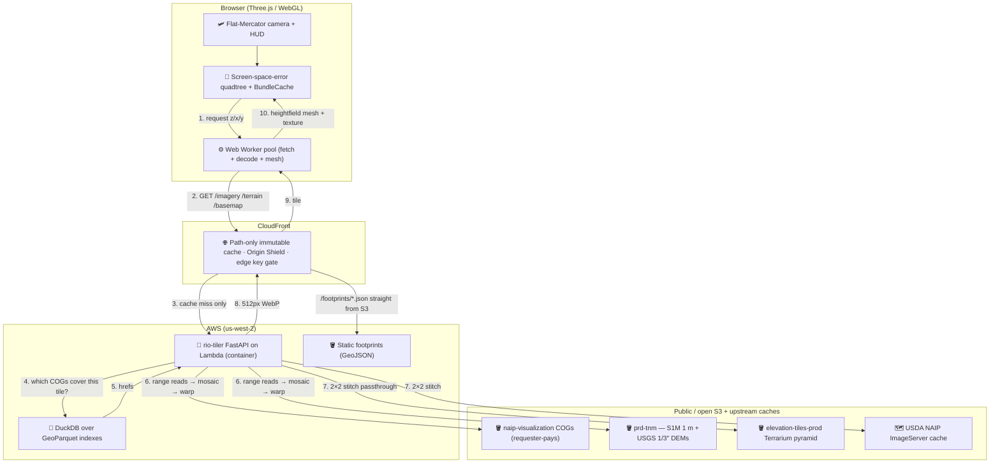

# threejs-cf-zxy-s1m

[](https://github.com/mwkorver/threejs-cf-zxy-s1m/actions/workflows/ci.yml)
[](https://github.com/astral-sh/ruff)

> [!NOTE]
> **Prototype, provided as-is.** This is a working exploration, not a maintained
> product — issues and pull requests aren't monitored, so please fork rather
> than wait on changes here. It is the companion to
> [deckgl-s3-cog-s1m](https://github.com/mwkorver/deckgl-s3-cog-s1m), which
> renders the same federal datasets with the opposite architecture.

A **CONUS flight-simulator-style streaming viewer**: NAIP aerial imagery and
USGS 3DEP S1M 1-meter terrain, normalized server-side onto a single EPSG:3857
`z/x/y` quadtree and streamed to a Three.js client through CloudFront.

> [!IMPORTANT]
> **Read [FLIGHT-SIM-PLAN.md](FLIGHT-SIM-PLAN.md) first** — it holds the
> architecture, the locked decisions, and the phased plan. This repo is the
> Phase 0/1 build: fly a camera over one corridor (New Jersey, NAIP) with
> server tiles end-to-end.

## Why this repository exists

Its sibling project, [deckgl-s3-cog-s1m](https://github.com/mwkorver/deckgl-s3-cog-s1m),
reads Cloud-Optimized GeoTIFFs **directly in the browser** over HTTP range
requests — no tile server, no terrain server. That architecture is excellent
for inspecting a viewport: you see exactly the source pixels, and the only
backend is a small index lookup.

It is a poor fit for *flight*. A camera moving at 800 knots crosses tile
boundaries several times a second, and every new COG means fresh range reads,
fresh TIFF decode, and a per-source CRS warp on the client — all while the
frame budget is 16 ms. The client also has to understand every source's
quirks: NAIP's requester-pays bucket, S1M's Albers projection, the 1/3-arcsecond
fallback where 1-meter coverage hasn't landed yet.

So this repository inverts the design. Every source — 1 m or 10 m DEM, COG
mosaic or proxied pyramid — is normalized **server-side** onto the same 512 px
`z/x/y` grid and encoding, so the client speaks exactly one tile contract and
never learns which source produced a tile. Warm tiles are CloudFront edge hits;
only misses invoke a Lambda. The browser gets to spend its budget on rendering.

The trade is explicit: you give up direct-from-source pixels and accept a
render tier, in exchange for a client simple enough to fly.

## Architecture



1. **One tile contract.** The client requests 512 px imagery and elevation over
   a single XYZ Web-Mercator quadtree. It never knows which source produced a
   tile (beyond the `X-DEM-Source` debug header).
2. **Server-side normalization.** At high zoom the Lambda builds tiles from
   source COGs — locating intersecting files via a DuckDB GeoParquet index,
   then mosaicking and warping them onto the tile grid. At low zoom it skips
   the COGs and proxies pre-rendered pyramids instead.
3. **The browser only ever talks to CloudFront.** Warm tiles are edge-cache
   hits (path-only keys, immutable); only misses invoke the Lambda.

Per zoom band, the source data is:

| Tiles | Zoom | Source | How |
|---|---|---|---|
| Imagery | ≥ 14 | NAIP COGs (requester-pays USDA S3) | DuckDB index → rio-tiler mosaic |
| Imagery | ≤ 13 | USDA NAIP ImageServer tile cache | `/basemap` 2×2 stitch of 256 px children |
| Terrain | ≥ 15 | S1M 1 m DEM COGs (`prd-tnm` S3, Albers) | index → mosaic → warp; voids filled from 1/3″ |
| Terrain | 11–14 | USGS 1/3″ (10 m) DEM COGs (`prd-tnm` S3) | same path, no fill |
| Terrain | < 11 | `elevation-tiles-prod` Terrarium pyramid | 2×2 stitch passthrough (no COGs) |

---

## Key Technical Features

### 1. One encoding, end to end (Terrarium)
Elevation ships as **Terrarium-encoded Terrain-RGB in lossless WebP**, the same
packing `elevation-tiles-prod` already uses. That makes the far-field path a
pure 2×2 pixel copy — no decode, no re-encode, and no conversion bugs at the
zoom boundary where near-field S1M meets the global pyramid. The client runs
exactly one decoder everywhere. Imagery ships as lossy WebP (q≈75).

### 2. Immutable tiles that are never wrong
Tiles are served `max-age=31536000, immutable`, so a bad tile is a *permanent*
bad tile. The render path is written around that: a source read that fails
**transiently** (network, 5xx, throttling) returns 503 with `Retry-After` so the
client retries, while only a *genuinely absent* source falls back to sea level
or a coarser DEM. Unknown failure modes fail toward 503 rather than baking a
hole into a tile that can never be evicted. Endpoints also 404 above their
source's native resolution, so the CDN never caches upsampled junk over an
unbounded key space.

### 3. Path-only cache keys
Layer and year live in the **path**, never a query string, and the CloudFront
cache policy forwards no query strings, cookies, or headers. Every viewer
therefore shares one cached object per tile. Origin Shield funnels all POPs
through one regional cache, so a cold tile costs at most one Lambda render
globally instead of one per POP. The dev access key rides in a query param
precisely *because* it is outside the cache key — rotating it needs no
invalidation.

### 4. Screen-space-error LOD with skirts
The client refines a tile quadtree while a tile's geometric error projects to
more than a pixel threshold on screen — monotonic in distance, so LOD rings can
never invert. Server tiles carry no overlap ring; seam hiding is entirely the
client's job, via one extra vertex ring per tile dropped by a per-zoom skirt
height that handles both same-zoom cracks and cross-LOD T-junctions.

### 5. Mercator-correct verticals
A Mercator meter is not a ground meter. Every true-meters → world conversion
routes through `sec(lat)`, so slopes don't flatten going north. Positions are
emitted relative to each tile's NW anchor as float32 — raw Mercator X for CONUS
is ~1e7, where float32 resolution is ~1 m, useless against 30 cm imagery.

### 6. Off-thread streaming
Fetch, decode, and mesh building run in a Web Worker pool with priority
queueing, abort-on-cancel, and velocity-vector prefetch along the flight path.
Tile URL construction and imagery-source routing live in one shared module so
the worker (production) and the main-thread fallback (what the tests exercise)
can never drift apart.

---

## Repository Structure

| Directory | What | Plan ref |
|---|---|---|
| [`tiler/`](tiler) | Thin rio-tiler FastAPI service (Lambda container): imagery + terrain tiles | §4.1, §4.2, §10.4 |
| [`client/`](client) | TypeScript client: flat Mercator world, terrain meshes with skirts, engine spikes | §5, §6, §10.2 |
| [`infra/`](infra) | SAM/CloudFormation: tiler stack → edge (CloudFront) stack | §3, §7 |

### Tile contracts (v0)

- `GET /imagery/{layer}/{year}/{z}/{x}/{y}.webp` — 512 px WebP q≈75, path-only
  cache keys, per-layer maxzoom from registry `gsd`.
- `GET /terrain/{z}/{x}/{y}.webp` — 512 px **Terrarium**-encoded Terrain-RGB,
  lossless WebP, vanilla registration (no overlap); the client builds skirts.
- `GET /basemap/{z}/{x}/{y}.webp` — low-zoom 512 px imagery stitched from the
  USDA NAIP ImageServer cache (the browser never hits ArcGIS directly).
- `GET /footprints/{s1m,usgs13}.json` — static gzipped GeoJSON of DEM COG
  footprints, served straight from S3 (no Lambda); rebuilt by
  [`tiler/scripts/build_footprints.py`](tiler/scripts/build_footprints.py).

All four are path-only by design. DEM band thresholds are tiler **config**
(`TILER_USGS_MIN_ZOOM` / `TILER_S1M_MIN_ZOOM`), never per-request parameters —
they change what a tile *contains*, which must not vary independently of the
cache key.

---

## Getting Started

### Prerequisites
* **Node.js** (v20+) — CI runs on Node 20
* **Python** (3.12+)
* **Docker** (for AWS SAM container builds)
* **AWS CLI** & **AWS SAM CLI** (for cloud deployments; reads need credentials
  because NAIP is requester-pays)

### 1. Installation

```bash
# tiler (installable package; [dev] adds pytest + ruff)
cd tiler && pip install -e ".[dev]"

# client
cd client && npm install
```

> [!NOTE]
> The tiler's virtualenv stores absolute paths, so it does **not** survive the
> repo directory being renamed or moved. If `pytest` suddenly can't import
> `tiler`, recreate it: `rm -rf .venv && python3 -m venv .venv && .venv/bin/pip install -e ".[dev]"`.

### 2. Local Development

```bash
# tiler on :8000
cd tiler && uvicorn tiler.app:app --reload

# client on :5180
cd client && npm run dev
```

The viewer defaults to the deployed CloudFront distribution. Override the
source with a query param:

| URL | Tiles come from |
|---|---|
| `http://localhost:5180/` | deployed CloudFront (default) |
| `http://localhost:5180/?src=tiler-local` | local uvicorn on `:8000` |
| `http://localhost:5180/?src=local` | baked static tiles in `client/public/tiles/` |

Inspect real tiles for any CONUS location (needs AWS credentials) — writes a
self-contained swipe-comparison page, imagery vs S1M hillshade:

```bash
cd tiler && python scripts/preview.py 40.48 -74.66 15 --layer naip --year 2023
```

### 3. Testing

CI ([`.github/workflows/ci.yml`](.github/workflows/ci.yml)) runs the checks
below on every push to `master` and every pull request. Both suites are
**hermetic** — all S3 and HTTP reads are mocked, so no AWS credentials and no
network access are required.

TypeScript client (`tsc` + Vitest) — covers the tile math, the LOD/transition
logic, the worker pool, and the shared tile-URL routing:

```bash
cd client && npm run typecheck && npm test
```

Python tiler (Ruff + pytest) — covers the endpoint contracts, the Terrarium
encoding round-trip, tile assembly, and the transient-failure handling:

```bash
cd tiler && ruff check . && python -m pytest
```

Ruff is deliberately scoped to `E9` (syntax/IO errors) and `F` (pyflakes:
undefined names, unused imports), so a lint failure always means something is
actually broken rather than merely unfashionable.

### 4. Deployment

Deploys to **`us-west-2`**, the region holding the GeoParquet lake and the
source COG buckets (`naip-visualization`, `prd-tnm`), keeping compute and the
bulk of imagery reads in-region.

```bash
# 1. tiler stack (Lambda container behind an IAM-auth Function URL).
#    On a machine running colima rather than Docker Desktop, point SAM at
#    colima's socket first, e.g.:
#    export DOCKER_HOST=unix://$HOME/.colima/default/docker.sock
sam build -t infra/tiler.yaml
sam deploy --stack-name flight-sim-tiler --region us-west-2 \
  --resolve-s3 --resolve-image-repos --capabilities CAPABILITY_IAM \
  --no-confirm-changeset --no-fail-on-empty-changeset

# 2. edge stack (CloudFront), wired to the tiler stack's outputs
infra/deploy-edge.sh
```

The Function URL is `AWS_IAM`-authed (CloudFront OAC signs origin requests), so
it can't be `curl`ed directly — smoke-test by invoking the Lambda with a
Function-URL event instead. See [infra/README.md](infra/README.md) for that,
the footprint rebuild, and the runtime gotchas baked into the code.

`deploy-edge.sh` reads the dev access key from the gitignored repo-root
`.tile-key`, passes it to CloudFormation as a `NoEcho` parameter, and mirrors
both the key and the distribution domain into `client/.env.local` so the
browser and the edge can't drift apart. With no key present the distribution
deploys open — which is also the escape hatch if you lock yourself out.

The key is **not** a real secret: it ships in the client bundle and is visible
in devtools. It exists to keep crawlers and shared URLs from burning
requester-pays reads on a dev distribution, and it is enforced at
*viewer-request* — CloudFront serves cache hits without contacting the origin,
so origin-side auth would leave every already-cached tile open.

---

## Acknowledgements

* **[USGS 3DEP](https://www.usgs.gov/3d-elevation-program)** for the Seamless
  1-meter DEM (S1M) and the 1/3-arcsecond DEMs, and **USDA FPAC/APFO** for NAIP
  — both published openly on S3.
* **[rio-tiler](https://github.com/cogeotiff/rio-tiler)**, **[GDAL](https://gdal.org/)**,
  and the **[COG](https://www.cogeotiff.org/)** standard, which do the real work
  of turning range reads into tiles.
* **[DuckDB](https://duckdb.org/)** for in-process spatial queries over
  GeoParquet, removing the need for an always-on spatial database.
* **[Mapzen / Terrarium](https://github.com/tilezen/joerd/blob/master/docs/formats.md)**
  and the AWS-hosted `elevation-tiles-prod` pyramid for the global elevation
  fallback and its encoding.
* **[Three.js](https://threejs.org/)** for the rendering layer.
