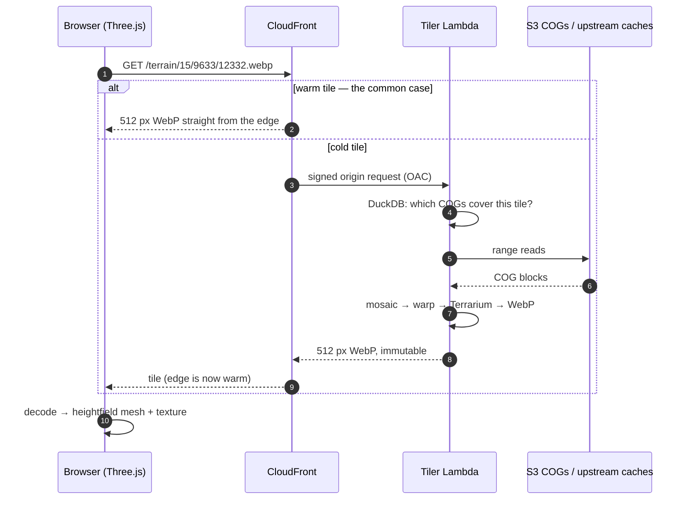

# threejs-cf-zxy-s1m

[](https://github.com/mwkorver/threejs-cf-zxy-s1m/actions/workflows/ci.yml)
[](LICENSE)
[](https://github.com/astral-sh/ruff)

> [!NOTE]
> **Public prototype, released under [MIT](LICENSE) — use, fork, and adapt it freely.**
> It is provided as-is, with no support or active maintenance; issues and pull
> requests aren't monitored, so please fork rather than wait on changes here.
> This demo builds off of
> [deckgl-s3-cog-s1m](https://github.com/mwkorver/deckgl-s3-cog-s1m), which
> renders the same federal datasets with the opposite architecture.

A **CONUS flight-simulator-style streaming viewer**: NAIP aerial imagery and
USGS 3DEP S1M 1-meter terrain, normalized server-side onto a single EPSG:3857
`z/x/y` quadtree and streamed to a Three.js client through CloudFront.


<sub>In flight at 43.527 N, −109.703 W — 8,019 m, heading 341° — over the upper
Wind River country, Wyoming. NAIP aerial imagery draped on 1 m S1M terrain, both
streamed as `z/x/y` WebP tiles. Vertical exaggeration is **1.5×**, the panel's
default, so relief reads steeper than truth. The counters are a live flight, not
a cold load: 1,028 tiles prefetched along the flight vector, and 1,463 of 2,570
tile textures served by recycling rather than allocation. They are also a
capture of an older build — the GPU budget has since gone to 512 MB, and the
210-against-204 tile count in the shot is the working-set overrun that
[`67e94a9`](../../commit/67e94a9) fixed.</sub>

What's built today: a camera you can fly over 1-meter S1M terrain, centered on
the Wyoming S1M tile group, with server tiles end-to-end. Everything below —
the architecture, the tile contracts, and how to run it — is self-contained;
[FLIGHT-SIM-PLAN.md](FLIGHT-SIM-PLAN.md) holds the longer-form design record
and the phases still ahead, and is worth reading only if you want the reasoning
behind a decision rather than the decision itself.

## Why this repository exists

Its sibling project, [deckgl-s3-cog-s1m](https://github.com/mwkorver/deckgl-s3-cog-s1m),
reads Cloud-Optimized GeoTIFFs **directly in the browser** over HTTP range
requests — no tile server, no terrain server. That architecture is excellent
for inspecting a viewport: you see exactly the source pixels, and the only
backend is a small index lookup.

But that is a poor fit for *flight*. A camera moving at 800 knots crosses tile
boundaries several times a second, and every new COG means fresh range reads,
fresh TIFF decode, and a per-source CRS warp on the client — all while the
frame budget is 16 ms. The client also has to understand every source's
quirks: NAIP's requester-pays bucket, S1M's Albers projection, the 1/3-arcsecond
fallback where 1-meter coverage hasn't landed yet.

So this repository inverts the design. Every source — 1 m or 10 m DEM, COG
mosaic or proxied pyramid — is normalized **server-side** onto the same 512 px
`z/x/y` grid and encoding, so the client speaks exactly one tile contract and
never learns which source produced a tile. Warm tiles are CloudFront edge hits;
only misses invoke Lambda. The browser gets to focus on rendering.

The trade is explicit: you give up direct-from-source pixels and accept a
render tier, in exchange for a client simple enough to fly.

### A twenty-year callback

Part of the interest in building this was to find out whether anything we built
into [**pTolemy3D**](https://github.com/mwkorver/ptolemy3d) over twenty years ago
still holds up. That viewer solved
streaming-terrain flight in Java and JOGL, against JPEG2000 imagery and a very
different web — but the hard parts of flying a camera over tiles have not changed much.

Several of its ideas came across intact: a background loading pipeline so the
render loop never stalls, nearest-tile-first scheduling so the closest terrain
wins the next download slot, aborting requests for tiles that left the view, and
altitude-scaled movement speed. Others did not survive contact — its view-cone
logic is frustum culling, not LOD, and an early attempt to scale subdivision by
camera pitch here caused LOD inversions and was replaced by screen-space error.

[**README-PTOLEMY3D.md**](README-PTOLEMY3D.md) traces each pattern from the
original implementation to where it now lives in `client/src/core/`.

### Why not TiTiler or cogeo-mosaic?

Good question, since both exist and this repo leans on
[rio-tiler](https://github.com/cogeotiff/rio-tiler) for the actual reads.

[**TiTiler**](https://github.com/developmentseed/titiler) is a more capable
tiler than this one and would be the right answer for a general-purpose
service. Its flexibility is the problem here: its endpoints are configured
through query strings (`?rescale=`, `?bidx=`, `?expression=`, `?colormap=`), and
this design needs the opposite — the URL *is* the cache key. Every rendering
decision is frozen server-side into a fixed contract (512 px, Terrarium,
lossless WebP for elevation) so CloudFront can forward no query strings at all
and every viewer shares one immutable object per tile. Adopting TiTiler would
mean locking down most of what makes it worth adopting.

[**cogeo-mosaic**](https://github.com/developmentseed/cogeo-mosaic) is the
closer call, and the honest answer is narrower than "the asset set is dynamic."

That defence doesn't hold up. NAIP is re-flown per state every year or two, and
S1M grows in batches — the last index rebuild added 1,536 tiles and retired 128
out of ~11.7k. That's a periodic batch job, not a stream, and a MosaicJSON
regenerated on the same cadence would track it perfectly well. The
newest-vintage-per-region rule isn't the differentiator either: it can be baked
in at build time, one mosaic per requested year, each carrying every region's
newest vintage at or before it. On the merits of the data alone, cogeo-mosaic
would do this job.

The actual reason is ownership. The GeoParquet lake is shared, canonical
infrastructure this repo *reads but does not write* — the ingest pipeline in
[`deckgl-s3-cog-s1m`](https://github.com/mwkorver/deckgl-s3-cog-s1m) maintains
it, and the analytic RGBIR collection sitting beside `naip-visualization`
belongs to that project. It already answers "which COGs intersect this tile,"
which is precisely `/search`. Adopting MosaicJSON would mean deriving and
republishing a second index from an upstream this repo doesn't control, then
keeping the two in step forever. Querying the index directly is one ~20-line
SQL builder ([`resolver.py`](tiler/src/tiler/resolver.py)); rio-tiler's
`mosaic_reader` still does the pixel work either way.

That choice has a real cost, worth stating plainly: DuckDB rides along in the
Lambda (extensions baked into the image so the cold path doesn't pay a
download), the SQL is mine to maintain, and the index has to be written with a
row-group size small enough that statistics-based pruning does anything at all
— a regression there is invisible until you profile. cogeo-mosaic is less code
and far better tested. This is a reuse decision, not a capability one: without
an existing shared lake, MosaicJSON wins.

## Architecture



1. **One tile contract.** The client requests 512 px imagery and elevation over
   a single XYZ Web-Mercator quadtree. It never knows which source produced a
   tile (beyond the `X-DEM-Source` debug header).
2. **Server-side normalization.** At high zoom the Lambda builds tiles from
   source COGs — locating intersecting files via a DuckDB GeoParquet index,
   then mosaicking and warping them onto the tile grid. At low zoom it skips
   the COGs and proxies pre-rendered pyramids instead.
3. **The browser only ever talks to CloudFront.** Warm tiles are edge-cache
   hits (path-only keys, immutable); only misses invoke the Lambda.

Per zoom band, the source data is:

| Tiles | Zoom | Source | How |
|---|---|---|---|
| Imagery | ≥ 14 | NAIP COGs (requester-pays USDA S3) | DuckDB index → rio-tiler mosaic |
| Imagery | ≤ 13 | USGS NAIP ImageServer (dynamic `exportImage`) | `/basemap` one 512 px render per tile |
| Terrain | ≥ 15 | S1M 1 m DEM COGs (`prd-tnm` S3, Albers) | index → mosaic → warp; voids filled from 1/3″ |
| Terrain | 11–14 | USGS 1/3″ (10 m) DEM COGs (`prd-tnm` S3) | same path, no fill |
| Terrain | < 11 | `elevation-tiles-prod` Terrarium pyramid | 2×2 stitch passthrough (no COGs) |
| Buildings | ≥ 14 | Overture GeoParquet (S3) | DuckDB `ST_AsMVT` → MVT, extruded client-side |


<sub>Buildings are the one layer the database emits in its final wire format:
`ST_AsMVT` assembles the vector tile inside DuckDB, and the client extrudes the
footprints onto terrain it already has.</sub>

---

## Key Technical Features

### 1. One encoding, end to end (Terrarium)
Elevation ships as **Terrarium-encoded Terrain-RGB in lossless WebP**, the same
packing `elevation-tiles-prod` already uses. That makes the far-field path a
pure 2×2 pixel copy — no decode, no re-encode, and no conversion bugs at the
zoom boundary where near-field S1M meets the global pyramid. The client runs
exactly one decoder everywhere. Imagery ships as lossy WebP (q≈75).

### 2. Immutable tiles that are never wrong
Tiles are served `max-age=31536000, immutable`, so a bad tile is a *permanent*
bad tile. The render path is written around that: a source read that fails
**transiently** (network, 5xx, throttling) returns 503 with `Retry-After` so the
client retries, while only a *genuinely absent* source falls back to sea level
or a coarser DEM. Unknown failure modes fail toward 503 rather than baking a
hole into a tile that can never be evicted. Endpoints also 404 above their
source's native resolution, so the CDN never caches upsampled junk over an
unbounded key space.

### 3. Path-only cache keys
Layer and year live in the **path**, never a query string, and the CloudFront
cache policy forwards no query strings, cookies, or headers. Every viewer
therefore shares one cached object per tile. Origin Shield funnels all POPs
through one regional cache, so a cold tile costs at most one Lambda render
globally instead of one per POP. The dev access key rides in a query param
precisely *because* it is outside the cache key — rotating it needs no
invalidation.

### 4. Screen-space-error LOD with skirts
The client refines a tile quadtree while a tile's geometric error projects to
more than a pixel threshold on screen — monotonic in distance, so LOD rings can
never invert. Server tiles carry no overlap ring; seam hiding is entirely the
client's job, via one extra vertex ring per tile dropped by a per-zoom skirt
height that handles both same-zoom cracks and cross-LOD T-junctions.

### 5. Mercator-correct verticals
A Mercator meter is not a ground meter. Every true-meters → world conversion
routes through `sec(lat)`, so slopes don't flatten going north. Positions are
emitted relative to each tile's NW anchor as float32 — raw Mercator X for CONUS
is ~1e7, where float32 resolution is ~1 m, useless against 30 cm imagery.

### 6. Off-thread streaming
Fetch, decode, and mesh building run in a Web Worker pool with priority
queueing, abort-on-cancel, and velocity-vector prefetch along the flight path.
Tile URL construction and imagery-source routing live in one shared module so
the worker (production) and the main-thread fallback (what the tests exercise)
can never drift apart.

---

## Repository Structure

| Directory | What | Plan ref |
|---|---|---|
| [`tiler/`](tiler) | Thin rio-tiler FastAPI service (Lambda container): imagery + terrain tiles | [§4.1](FLIGHT-SIM-PLAN.md#41-imagery), [§4.2](FLIGHT-SIM-PLAN.md#42-terrain), [§10.4](FLIGHT-SIM-PLAN.md#10-open-questions-settle-in-phase-0) |
| [`client/`](client) | TypeScript client: flat Mercator world, terrain meshes with skirts, three.js renderer | [§5](FLIGHT-SIM-PLAN.md#5-client-architecture-notes), [§6](FLIGHT-SIM-PLAN.md#6-engine-decision-custom-renderer-vs-cesiumjs), [§10.2](FLIGHT-SIM-PLAN.md#10-open-questions-settle-in-phase-0) |
| [`infra/`](infra) | SAM/CloudFormation: tiler stack → edge (CloudFront) stack | [§3](FLIGHT-SIM-PLAN.md#3-architecture), [§7](FLIGHT-SIM-PLAN.md#7-reuse-from-deckgl-s3-cog-s1m) |

### Tile contracts

- `GET /imagery/{layer}/{year}/{z}/{x}/{y}.webp` — 512 px WebP q≈75, path-only
  cache keys, per-layer maxzoom from registry `gsd`.
- `GET /terrain/{z}/{x}/{y}.webp` — 512 px **Terrarium**-encoded Terrain-RGB,
  lossless WebP, vanilla registration (no overlap); the client builds skirts.
- `GET /basemap/{z}/{x}/{y}.webp` — low-zoom 512 px imagery rendered from the
  USGS NAIP ImageServer (the browser never hits ArcGIS directly).
- `GET /footprints/{s1m,usgs13}.json` — static gzipped GeoJSON of DEM COG
  footprints, served straight from S3 (no Lambda); rebuilt by
  [`tiler/scripts/build_footprints.py`](tiler/scripts/build_footprints.py).
- `GET /buildings/{z}/{x}/{y}.pbf` — MVT building footprints and heights from
  the Overture lake, extruded client-side. Served at z ≥ 14, 404 below.

All five are path-only by design. DEM band thresholds are tiler **config**
(`TILER_USGS_MIN_ZOOM` / `TILER_S1M_MIN_ZOOM`), never per-request parameters —
they change what a tile *contains*, which must not vary independently of the
cache key.

---

## External dependencies, and how they fail

This is a prototype partially standing on 2 public data services it does not control, and
two of them have taken the viewer down. Both failures look like the app is
broken and are not, so they are worth recognizing on sight.

Neither is hypothetical: both happened within ten days of each other in August
2026, and the notes below are what each one actually looked like.

### Overture retires the release the buildings manifest points at

`/buildings` does a two-step lookup. A manifest names which Overture GeoParquet
row groups intersect a tile, and only those files are read. That manifest is a
pointer into **one specific Overture release** — and Overture deletes old
releases as new ones land.

When that happens, `read_parquet` cannot open files that no longer exist,
`BuildingResolver.resolve()` returns `None`, and every building tile answers
`404 "no building coverage"`. Manhattan reports no buildings while holding
2,700 of them.

**Symptom:** buildings vanish everywhere, at every zoom, and stay gone.
`curl` a known-good tile — `/buildings/14/4824/6157.pbf` should be ~220 KB.

**Fix:** rebuild the manifest against the current release. The builder lives in
the sibling repo, not this one:

```bash
# in ../deckgl-s3-cog-s1m — uses PyArrow deliberately; DuckDB/httpfs hits
# range-read errors on this dataset
python3 app/api/build_overture_buildings_index.py \
  --release 2026-08-19.0 --output /tmp/buildings-index.parquet
```

It takes about 15 seconds and scans 512 footers. Then publish it to **both**
paths, because they are not the same file:

- the live one the Lambda reads, set by `TILER_BUILDING_LAKE_PATH` —
  `s3://threejs-cf-zxy-s1m-<account>-<region>/manifest-index/buildings/buildings.parquet`
- the seed under `TILER_SEED_BUCKET_PATH`, which `infra/deploy.sh` copies from
  on a first-run deploy only

Publishing to the seed alone changes nothing until a fresh account deploys.
Afterwards, invalidate `/buildings/*` so CloudFront stops serving the cached
404s. Validate before publishing by resolving a known tile: a z14 Newark tile
(`14/4818/6159`) should report **192** buildings.

### The imagery upstream goes down

`/basemap` renders from the USGS NAIP ImageServer at
`imagery.nationalmap.gov`. It has returned 502s, 504s, and — in the case of the
USDA service it replaced — stopped completing TLS handshakes entirely for
about six days.

The reason we go to the National Map for levels 14 and up is because building tiles from the source NAIP quarter quad COGs requires reading a very large number of them less than or equal to z 14. 

**Symptom:** ground renders as flat green terrain (`fallbackColor`, `0x556655`)
where imagery has not arrived. Terrain, buildings and the DEM are unaffected;
only the texture is missing.

**What the app does about it, so this degrades rather than breaks:**

- a failed imagery fetch no longer costs the tile its terrain, so you get flat
  ground rather than a hole with sky through it
- tiles retry three times, then settle for the fallback rather than billing
  requester-pays reads against a dead upstream forever
- the HUD `IMAGERY:` line reads `retrying N...` and then
  `N tiles unavailable (upstream)`, so the cause is on screen
- the tiler logs the actual reason (`basemap z/x/y unavailable: ... HTTP 502`),
  which is the only place it is recorded

**Fix:** wait. It is not your stack. Confirm with a direct request:

```bash
curl -s -o /dev/null -w '%{http_code} %{time_total}s\n' --max-time 45 \
  "https://imagery.nationalmap.gov/arcgis/rest/services/USGSNAIPImagery/ImageServer/exportImage?bbox=-8213617,4975133,-8211171,4977579&bboxSR=3857&imageSR=3857&size=512,512&format=png32&transparent=true&f=image"
```

Cached tiles keep serving throughout, which is why the viewer can look healthy
while every uncached tile fails — the `U` label's dot distinguishes them: green
means the tiler baked it just now, grey means CloudFront served it from the
edge and the origin was never asked.

---

## Getting Started

Needs Node 20+, Python 3.12+, Docker (for SAM container builds), and the AWS +
SAM CLIs with credentials for anything cloud-side — NAIP is requester-pays, so
reads are billed to the caller.

```bash
(cd tiler  && pip install -e ".[dev]")   # tiler: [dev] adds pytest + ruff
(cd client && npm install)               # client
```

The tiler's virtualenv stores absolute paths, so it does not survive the repo
being moved or renamed; if `pytest` stops importing `tiler`, delete `.venv` and
reinstall.

Run both locally — tiler on `:8000`, client on `:5180`:

```bash
(cd tiler  && uvicorn tiler.app:app --reload)   # one terminal
(cd client && npm run dev)                      # another
```

The viewer points at the deployed distribution by default. `?src=tiler-local`
sends it to the local uvicorn, `?src=local` to the baked tiles in
`client/public/tiles/`.

Both suites are hermetic — S3 and HTTP are mocked, so no credentials and no
network:

```bash
(cd client && npm run typecheck && npm test)
(cd tiler  && ruff check . && python -m pytest)
```

Deployment is two CDK stacks in `us-west-2`, the region holding the lake and
the source COGs. One script does all of it — build, both stacks, bucket seed,
invalidation, and `client/.env.local`:

```bash
infra/deploy.sh
```

[infra/README.md](infra/README.md) has everything else you need before pointing
that at a real account: the one-time bootstrap, the colima `DOCKER_HOST`
export, why the distribution deploys disabled, how the dev access key works,
smoke-testing the IAM-authed Function URL, and what to read in `cdk diff`
before deploying over live stacks. Index and asset builders are in
[tiler/scripts/](tiler/scripts/).

---

## Acknowledgements

* **[USGS 3DEP](https://www.usgs.gov/3d-elevation-program)** for the Seamless
  1-meter DEM (S1M) and the 1/3-arcsecond DEMs, and **USDA FPAC/APFO** for NAIP
  — both published openly on S3.
* **[rio-tiler](https://github.com/cogeotiff/rio-tiler)**, **[GDAL](https://gdal.org/)**,
  and the **[COG](https://www.cogeotiff.org/)** standard, which do the real work
  of turning range reads into tiles.
* **[DuckDB](https://duckdb.org/)** for in-process spatial queries over
  GeoParquet, removing the need for an always-on spatial database.
* **[Mapzen / Terrarium](https://github.com/tilezen/joerd/blob/master/docs/formats.md)**
  and the AWS-hosted `elevation-tiles-prod` pyramid for the global elevation
  fallback and its encoding.
* **[Three.js](https://threejs.org/)** for the rendering layer.

---

## Project docs

| File | What |
|---|---|
| [FLIGHT-SIM-PLAN.md](FLIGHT-SIM-PLAN.md) | The design record: why each decision went the way it did, and the phases still ahead |
| [README-PTOLEMY3D.md](README-PTOLEMY3D.md) | What this demo inherits from pTolemy3D, and what two decades changed |
| [infra/README.md](infra/README.md) | Deploying the tiler and edge stacks, plus the runtime gotchas |
| [SECURITY.md](SECURITY.md) | How to report a vulnerability privately, and what's in scope |
| [CONTRIBUTING.md](CONTRIBUTING.md) | Short version: this is a prototype, fork freely |

## License

This project is licensed under the [MIT License](LICENSE).
